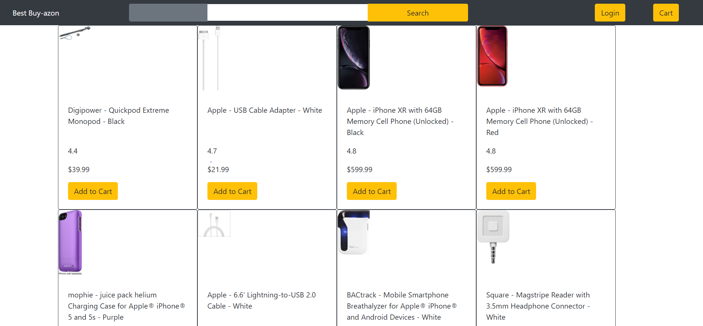

# Online-Marketplace

## User Story

As a user I want to be able to perform searches on items so purchase them.
As a user I want to be able to add and remove items from a cart and see a subtotal for all items so I can manage my intended purchase.

## Screen Shots




## Code of Interest

This code is of interest since I chose to use the localStore rather than the DB
for storing cart items.

```javascript
setQuery(query) {
    this.setState({ query: query });
    localStorage.setItem('state', JSON.stringify({ ...this.state, query: query }));
}

setCart(cart) {
    this.setState({ cart: cart });
    localStorage.setItem('state', JSON.stringify({ ...this.state, cart: cart }));
}
```

This format conversion code was of interest since I spent some time working out how it worked.  (I wasn't
familiar with ?= and ?! regexp operators.)

This regexp results in the match of three or fewer digits per replace attempt. ie.  1222333 will match 1 and then 222 and then 333.  The regexp actually matches as many digits as it can where the remaining unmatched
digits can be a multiple of a sequence of three digits (0,3,6,9, etc).

?=(regexp) is :valid match on (regexp)
?!(regexp) is :invalid match of (regexp) (the match will ignore the regexp match as part of the match)
  it also forces the match to be non-greedy  (ie. matches from right to left from the first non-
  number)

```javascript
const Format = {
    currency(num) {
        return '$'+num.toFixed(2).toString().replace(/(\d)(?=(\d{3})+(?!\d))/g, '$1,');
    }
}

export default Format;
```

## Getting Started

These instructions will get you a copy of the project up and running on your local machine for development and testing purposes. See deployment for notes on how to deploy the project on a live system.

### Prerequisites

Git, SVN, Git Desktop or Microsoft Visual Studio or some disk drive
space to unzip the contents of the repository.

### Installing a Local Instance

1) Visit https://github.com/redmarmaduke/online-marketplace.
2) Select the Clone or Download button
3) Select the most appropriate format/method for download. 

ex. using the command line git tool

### `git clone https://github.com/redmarmaduke/online-marketplace.git`

### `npm install`
 
### `npm start`

Runs the app in the development mode.<br />
Open [http://localhost:3000](http://localhost:3000) to view it in the browser.

## Built With

[Create React App](https://github.com/facebook/create-react-app).
[Create React App documentation](https://facebook.github.io/create-react-app/docs/getting-started).

## Authors

* **Manuel Nunes** (
[Github](https://github.com/redmarmaduke/) ,
[LinkedIn](https://www.linkedin.com/in/manuel-nunes-272ba31b/) ,
[Portfolio](https://redmarmaduke.github.io/portfolio.html)
)


## References

[Currency Regular Expression](https://coderwall.com/p/uccfpq/formatting-currency-via-regular-expression)
